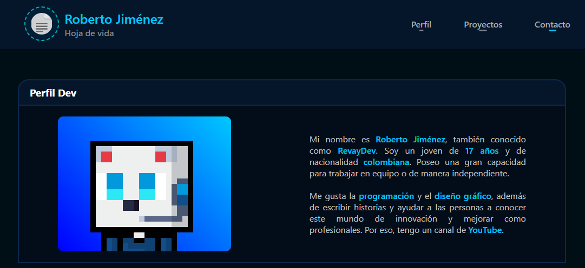

# Hoja de Vida · RevayDev

<p align="center">
  
</p>

## 👋 Sobre mí
💾 **Desarrollador Junior** y **estudiante de Ingeniería**.  
Me gusta programar, crear **programas**, **jueguitos** simples y experimentar con proyectos web y bots.

> [!IMPORTANT]
> Este repositorio contiene mi **hoja de vida** en formato web y enlaces a mis proyectos.  
> Licencia: **MIT**

<p align="center">
  
  
  
  
</p>

---

## 📇 Perfil rápido

<p align="center">
  
</p>

- **Nombre:** Roberto Jiménez  
- **Alias:** RevayDev  
- **Stack:** HTML · CSS · JavaScript · Java · Discord.js  
- **Intereses:** Desarrollo web, automatización, videojuegos simples


🌐 [Ver la página](https://revaydev.github.io/hoja-de-vida/)

> [!NOTE]
> Este repo fue creado para un parcial de desarroollo web para la univercidad, asi quetiene algunos erores.

---

## 📥 Cómo usar este repo
Clona el repositorio para revisar o modificar el código de la página web:

```bash
git clone https://github.com/RevayDev/hoja-de-vida.git
